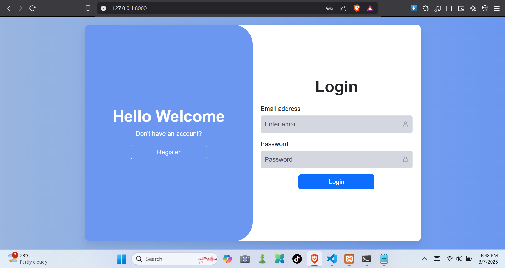
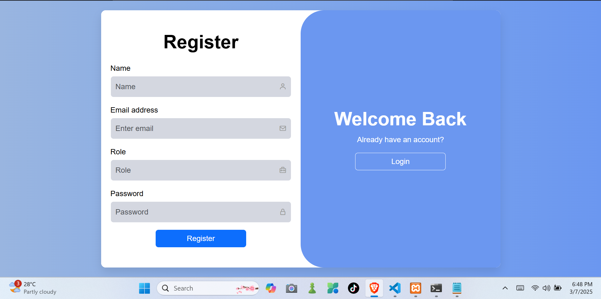
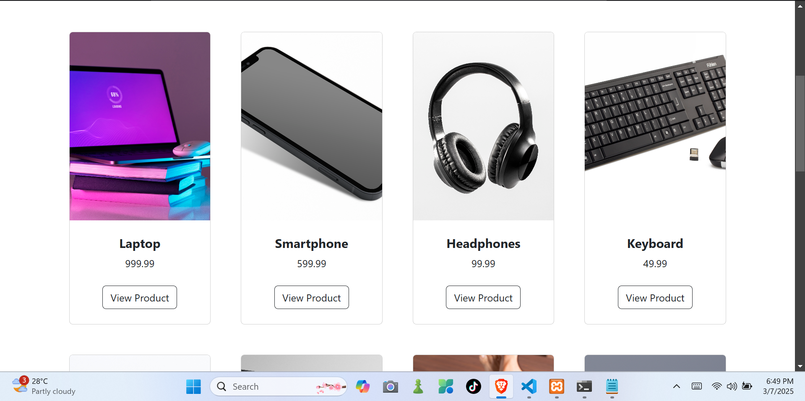

# Optimized Sales Management System

## Project Overview
The **Optimized Sales Management System** is a database-driven application designed to manage online product sales efficiently. This system aims to implement an optimized database structure with advanced SQL queries, transaction management, and a simple user interface to facilitate usability.


## Project Screenshots







### **Key Features**
- Relational database with proper normalization
- Advanced SQL queries (JOINs, subqueries, views, stored procedures, triggers)
- Query optimization for performance enhancement
- Transaction management ensuring data integrity (ACID compliance)
- Optional interactive application interface for usability

## **Tech Stack**
- **Database:** MySQL / phpMyAdmin / Any SQL-supported platform
- **Backend:** Python DJANGO
- **Frontend:** HTML / CSS / JavaScript / Bootstrap

## **Project Objectives**
1. **Database Design & Implementation**  
   - Create an ER Diagram for the database structure.
   - Design a normalized relational database with key tables:
     - Users
     - Products
     - Orders
     - OrderDetails
     - Transactions
   - Deliverable: SQL script to create tables.

2. **Advanced SQL Queries**  
   - Retrieve order lists with user details and total amount spent.
   - Identify best-selling products and inactive users.
   - Display monthly revenue using GROUP BY.
   - Implement stored procedures and triggers.
   - Deliverable: SQL file containing queries.

3. **Query Optimization**  
   - Analyze and optimize slow-performing queries.
   - Implement indexing and optimized JOINs/subqueries.
   - Deliverable: Optimization report (max 2 pages).

4. **Transaction Management**  
   - Ensure atomicity for order placement.
   - Implement rollback and commit mechanisms.
   - Deliverable: SQL script demonstrating transaction management.

5. **Simple Application Development (Optional Bonus)**  
   - Create a basic GUI or CLI application.
   - Implement user authentication, product viewing, and order placement.
   - Deliverable: Working application files & demo video.

6. **Documentation & Presentation**  
   - Final report on database structure, queries, optimizations, and transactions.
   - Video presentation explaining the system.
   - Deliverables: PDF report, video presentation, and peer evaluation form.

## **Project Status**
| Task | Status |
|------|--------|
| Database Design & Implementation |  ✅ Completed  |
| Advanced SQL Queries |  ✅ Completed  |
| Query Optimization | ✅ Completed  |
| Transaction Management |✅ Codmplete  |
| Application Development |  ✅ Codmplete  |
| Documentation & Presentation | ✅ Codmplete  |

## **How to Use**
1. Clone the repository:
   ```bash
   git clone https://github.com/Edimar18/sales_management_system.git
   ```
2. Export the sales_management_system.sql file to xampp
3. make sure that the mysql and php port are already running in xampp.
4. run python manage.py runserver

## **Contributors**
- **Edimar** - Database Developer & Project Lead
- **Ciara**
- **Josyl**
- **Vanessa**
- **Danilo**


## **License**
This project is licensed under the [MIT License](LICENSE).


